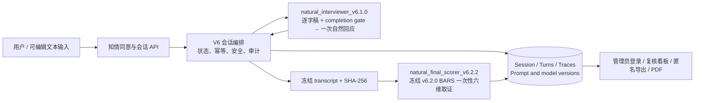
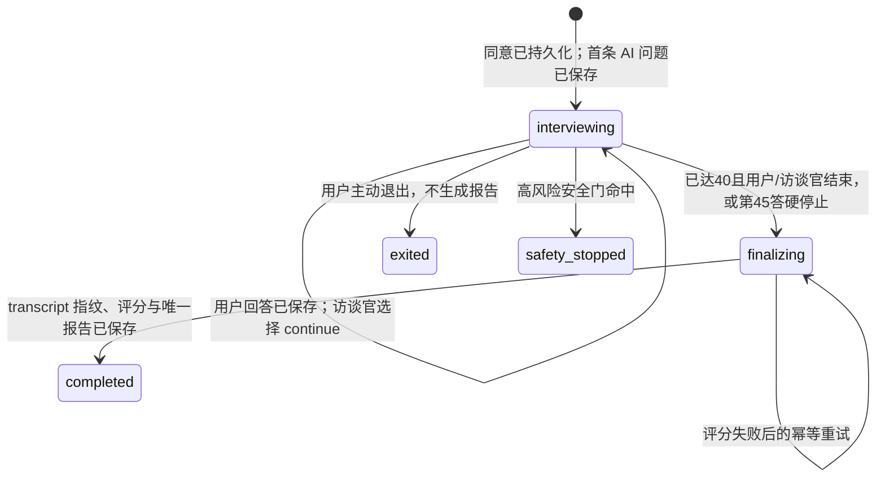

# 思衡 V6 架构合同

## 核心原则：访谈控制权属于访谈官，测量只在结束后发生

- 用户只看到“澄澄”、“有效回答 x/40”和必要的输入提示，不接触六维、评分或后台审计字段；该计数是正式数据完整性门禁，不表示阶段或维度覆盖。
- 访谈期模型读完整逐字稿及最小 `completion_gate`，只返回用户实际可见的自然回应及 `continue|finish`。门禁仅包含有效回答数、40/45 边界和是否允许结束；模型不接收目标维度、缺失维度、候选问题、coverage、阶段命令或每维预算，仍自主决定问什么、按什么顺序问以及如何表达。
- 终评与访谈官是独立调用。评分器读取冻结后的完整逐字稿和固定测量合同，不读取访谈官的内部评价作为证据。
- `v6.2.2` 只为终评调用显式禁用 thinking，以保证完整结构化输出；访谈官使用版本化的 `v6.1.0` 合同，模型配置保持 `deepseek-v4-flash`。

## 状态与事务边界

`finalizing` 是冻结点：保存完整逐字稿的 SHA-256 后，不得再接受普通回答。每个会话只能发布一份报告；评分调用失败时保留冻结稿，以相同指纹重试，绝不生成关键词或模板化“假报告”。

## 访谈期服务端只保留硬边界

服务端可以拦截、记录或拒绝以下情况：未同意、无可计数字符、从第 2 个有效回答起不足 20 个可计数字符、当前会话不接收回答、相同幂等键载荷不同、高风险内容、空/无效 JSON、模型泄露内部 Prompt/评分、明显有害输出、不足 40 个有效回答时请求正式报告，以及超过 45 个有效回答。只有服务端认可的短、完整澄清意图不计入有效回答且不受 20 字门禁；不可信的客户端 `interaction_kind` 提示若不满足契约，仍作为普通回答处理。安全输入和退出请求同样不计数且不受门禁；普通风格问题只写入质量标记，服务端不把自然问法替换成题库文本，也不替模型指定下一题。

一次回答的原子顺序为：

1. 校验会话、同意、高风险门与 `(session_id, client_turn_id)`。
2. 保存唯一用户 turn、输入方式、作答时长和调用审计；同键相同载荷重放原结果。
3. 将完整逐字稿交给访谈官；网络或结构失败最多进行一次修复调用。
4. 修复仍失败时，用户 turn 保留、会话仍可用、同一键可恢复；不生成固定兜底问题。
5. 40 个有效回答前拒绝模型提前结束；40–44 个回答间允许自然结束；第 45 个回答后确定性冻结逐字稿并开始/重试独立评分。

40 个有效回答是本轮正式数据完整性门槛，45 个有效回答是技术硬上限。二者只控制是否可结束和是否继续接收回答，不引入新题目、固定阶段或六维轮询，也不应被解释为心理测量分数阈值。

## 审计、隐私与可复核性

- 每轮保存用户/AI 文本、`client_turn_id`、输入方式、作答时长、模型与 Prompt 版本、调用状态、修复次数、异常与质量标记。
- 终评保存输入指纹、原始结构化输出、逐字 quote 的 turn 绑定、充分度、未校准置信度和人工复核建议。
- 管理端可查看完整对话、调用链、评分运行、人工复核和专家评分；生产环境通过单管理员的 Argon2id 凭据、8 小时 HttpOnly 会话 Cookie 和 CSRF 校验保护，前端不持有令牌或认证秘密。
- 匿名导出默认排除真实议题、用户自由文本、原话 quote、自由文本理由、精确时间戳和可稳定关联的标识符。
