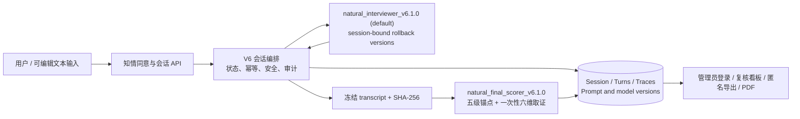
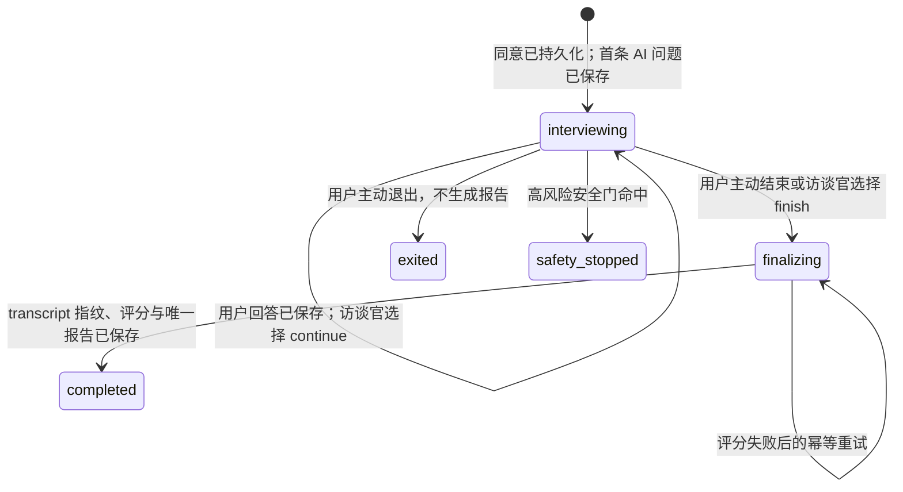

# 思衡 V6 架构合同

## 核心原则：访谈控制权属于访谈官，测量只在结束后发生

- 用户只看到“澄澄”、当前已完成的问答轮数和必要的输入提示，不接触六维、评分或后台审计字段；轮数不表示阶段、配额或上限。
- 访谈期模型读完整逐字稿，只返回用户实际可见的自然回应及 `continue|finish`。它不接收目标维度、缺失维度、候选问题、coverage、阶段命令、每维预算或固定轮次。
- `NATURAL_INTERVIEWER_PROMPT_VERSION` 默认为 `v6.1.0`；`v6.0.5`、`v6.0.4` 与 `v6.0.3` 完整保留为回滚版本。新会话按部署配置选择版本，后续轮次始终读取本会话 `natural_opening` Trace，不因部署切换而在同一会话内混用 Prompt。
- 访谈调用显式关闭思考模式，使用 512 tokens 和 25 秒总预算；首次最多 15 秒，剩余时间只允许一次重试。终评与准备度检查显式启用思考模式，继续使用 12000 tokens 与原 90 秒超时配置。
- 终评与访谈官是独立调用。评分器读取冻结后的完整逐字稿和固定测量合同，不读取访谈官的内部评价作为证据。

## 状态与事务边界

`finalizing` 是冻结点：保存完整逐字稿的 SHA-256 后，不得再接受普通回答。每个会话只能发布一份报告；评分调用失败时保留冻结稿，以相同指纹重试，绝不生成关键词或模板化“假报告”。

## 访谈期服务端只保留硬边界

服务端可以拦截、记录或拒绝以下情况：未同意、第二个及之后少于 20 个可见字符的普通回答、当前会话不接收回答、相同幂等键载荷不同、高风险内容、空/无效 JSON、模型泄露内部 Prompt/评分、明显有害输出以及 40 次技术上限。首个非空回答及完整的明确不确定短答可通过原有链路。普通风格问题只写入质量标记：服务端不把自然问法替换成题库文本，也不替模型指定下一题。

一次回答的原子顺序为：

1. 校验会话、同意、高风险门与 `(session_id, client_turn_id)`。
2. 保存唯一用户 turn、输入方式、作答时长和调用审计；同键相同载荷重放原结果。
3. 将完整逐字稿交给会话绑定版本的访谈官；网络、空响应或结构失败在总预算内最多重试一次。空响应重试只追加 JSON 输出协议提醒，网络重试保持原载荷。
4. 重试仍失败时，用户 turn 保留、会话仍可用、同一键可恢复；空响应与网络错误分别记录，不生成固定兜底问题。
5. 有效 `finish` 或用户主动结束时冻结逐字稿并开始/重试独立评分。

40 次限制仅用于避免意外无限循环。到达后服务端不再接受新回答，只允许用户结束并生成报告或退出；它不引入新题目，也不是可解释的测量阈值。

## 审计、隐私与可复核性

- 每轮保存用户/AI 文本、`client_turn_id`、输入方式、作答时长、模型与 Prompt 版本、调用状态、尝试次数、真实总耗时、异常类型与质量标记。
- 终评保存输入指纹、原始结构化输出、逐字 quote 的 turn 绑定、充分度、未校准置信度和人工复核建议。
- 管理端可查看完整对话、调用链、评分运行、人工复核和专家评分；生产环境通过单管理员的 Argon2id 凭据、8 小时 HttpOnly 会话 Cookie 和 CSRF 校验保护，前端不持有令牌或认证秘密。
- 匿名导出默认排除真实议题、用户自由文本、原话 quote、自由文本理由、精确时间戳和可稳定关联的标识符。
