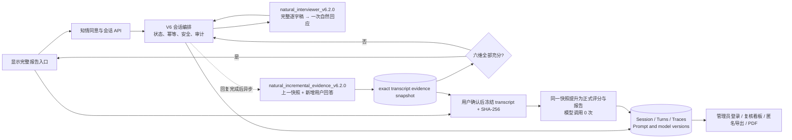
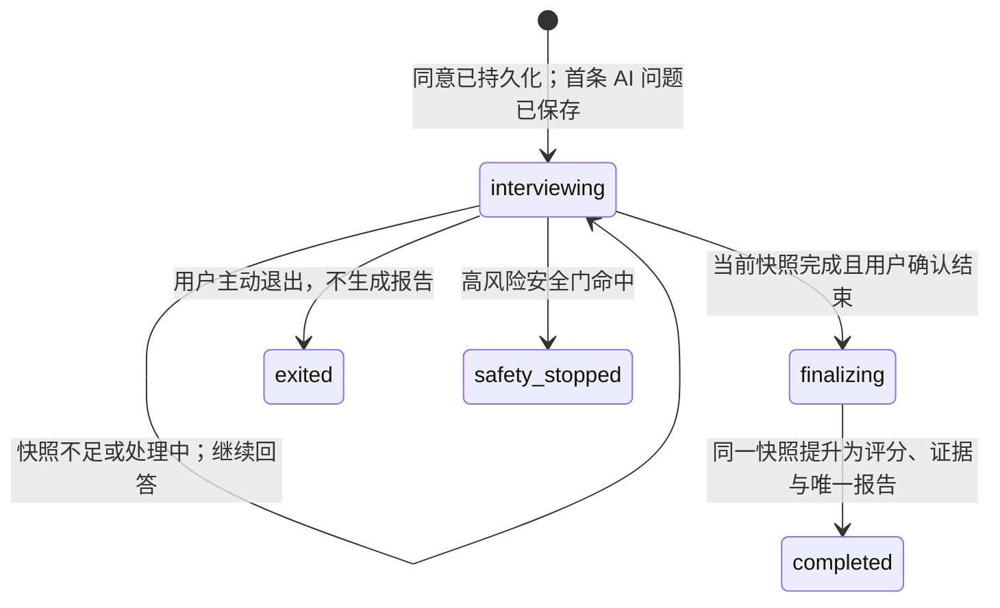

# 思衡 V6 架构合同

## 核心原则：访谈与取证并行，结束只由当前证据快照控制

- 用户只看到“澄澄”、当前已完成的问答轮数和必要的输入提示，不接触六维、评分或后台审计字段；轮数不表示阶段、配额或上限。
- 访谈期模型读完整逐字稿，只返回用户实际可见的自然回应及 `continue|finish`。它不接收目标维度、缺失维度、候选问题、coverage、阶段命令、每维预算或固定轮次。
- `NATURAL_INTERVIEWER_PROMPT_VERSION` 默认为 `v6.2.0`；`v6.1.1`、`v6.0.5`、`v6.0.4` 与 `v6.0.3` 完整保留。每个会话按 `natural_opening` trace 绑定版本，配置切换只影响新会话。
- 访谈调用关闭思考模式，使用 512 tokens 和 25 秒总预算。增量取证使用独立的关闭思考配置、2000 tokens、15 秒总预算和最多一次重试；它在访谈回复持久化后异步启动，不占用回复或输入框等待链路。
- 访谈官不读取证据覆盖，也不决定是否可以结束。增量整理器只接收上一份已验证快照和此后新增用户回答；服务端再用完整逐字稿验证所有 quote 的角色、轮次和连续子串。

## 状态与事务边界

`finalizing` 是冻结点：保存完整逐字稿的 SHA-256 后，不得再接受普通回答。冻结前必须校验客户端提交的检查 ID、逐字稿指纹和当前资产指纹。快照仍在处理或失败时会话保持 `interviewing`，不得遗漏最后一轮或退回旧快照。

V6.2 将模型意图与结束控制彻底分开：`finish/enough_understanding|natural_closure` 会被确定性改为继续追问，不能生成结束卡；`finish/user_requested` 只记录用户意图并提示使用页面结束入口，也不会绕过快照校验。旧 Prompt 与旧建议接受接口仅为既有会话回滚兼容，V6.2 前端不渲染自然停点入口。

## 访谈期服务端只保留硬边界

服务端可以拦截、记录或拒绝以下情况：未同意、第二个及之后少于 20 个可见字符的普通回答、当前会话不接收回答、相同幂等键载荷不同、高风险内容、空/无效 JSON、模型泄露内部 Prompt/评分、明显有害输出以及 40 次技术上限。首个非空回答及完整的明确不确定短答可通过原有链路。普通风格问题只写入质量标记：服务端不把自然问法替换成题库文本，也不替模型指定下一题。

一次回答的原子顺序为：

1. 校验会话、同意、高风险门与 `(session_id, client_turn_id)`。
2. 保存唯一用户 turn、输入方式、作答时长和调用审计；同键相同载荷重放原结果。
3. 将完整逐字稿交给会话绑定版本的访谈官；网络、空响应或结构失败在 25 秒总预算内共享最多一次重试。空响应重试只追加 JSON 输出协议提醒，网络重试保持原载荷。
4. 重试仍失败时，用户 turn 保留、会话仍可用、同一键可恢复；空响应与网络错误分别记录，不生成固定兜底问题。
5. AI 回复持久化后立即返回用户，并为当前精确逐字稿创建一个幂等增量任务；任务完成顺序不会覆盖更新版本。
6. 六维全部满足 `score != null`、`sufficient=true` 且至少一条有效用户原话时，前端才主动显示完整报告入口。用户可提前确认生成证据有限报告。
7. `/finalize` 只接受当前完成快照；冻结后直接提升其结果，报告阶段不调用模型。

40 次限制仅用于避免意外无限循环。到达后服务端不再接受新回答，只允许用户结束并生成报告或退出；它不引入新题目，也不是可解释的测量阈值。

## 审计、隐私与可复核性

- 每轮保存用户/AI 文本、`client_turn_id`、输入方式、作答时长、模型与 Prompt 版本、调用状态、尝试次数、真实总耗时、异常类型与质量标记。
- 每个快照保存逐字稿/资产指纹、完整结构化结果、最后处理的用户轮次、充分维度数、模型与 Prompt、尝试次数、耗时及失败信息；正式报告沿用完全相同的分数、证据和充分状态。
- 管理端可查看完整对话、调用链、评分运行、人工复核和专家评分；生产环境通过单管理员的 Argon2id 凭据、8 小时 HttpOnly 会话 Cookie 和 CSRF 校验保护，前端不持有令牌或认证秘密。
- 匿名导出默认排除真实议题、用户自由文本、原话 quote、自由文本理由、精确时间戳和可稳定关联的标识符。
